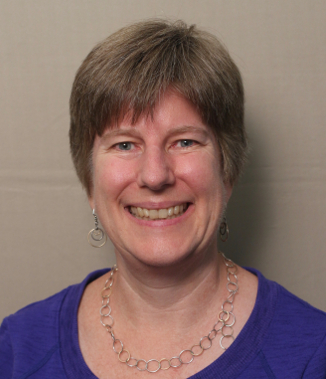
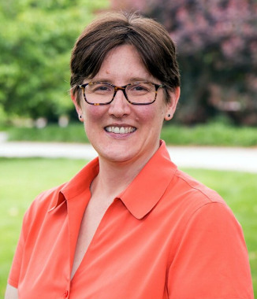
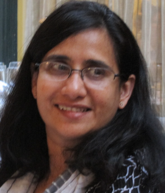

# {{page.title}}

- [Stop Harassment](https://www.acm.org/about-acm/policy-against-harassment)
- [Report Unacceptable Behaviour](https://www.acm.org/about-acm/reporting-unacceptable-behavior)
- [Support Freedom of Mobility](http://www.sigcomm.org/content/special-statement-freedom-mobility)
- [Protect Privacy](https://www.acm.org/about-acm/privacy-policy)

## SIGCOMM 2018 Ad-Hoc CARES Committee
Discrimination and harassment are not to be tolerated within our community, and we are making a step forward to prevent and address any forms of unacceptable behavior during SIGCOMM 2018. 

All SIGCOMM events and communications (emails, online social network groups, etc) must abide to [ACM policy against discrimination and harassment](https://www.acm.org/about-acm/policy-against-harassment). If a violation of this policy occurs, ACM urges reporting the incident to the event chairs or the ACM President, CEO, or COO. SIGCOMM recognizes that reporting to the conference chairs or an upper level ACM administrator can be intimidating, especially in the face of an already traumatic experience. Following the steps of SIGARCH, the SIGCOMM EC is considering the implementation of a new subcommittee, called SIGCOMM CARES – SIGCOMM Committee to Aid REporting on discrimination and haraSsment policy violations. 

In the mean time, and already available during the immediately upcoming SIGCOMM 2018, we will have an ad-hoc committee comprised of senior members of the community, namely Ellen Zegura, Jennifer Rexford, Craig Partridge and Sujata Banerjee, who are willing to listen to and help people who experience discrimination and harassment at the conference. The committee members can be a sounding board for these people and can provide advice on the steps necessary to have the matter further investigated by ACM. It is important to understand that for the matter to be reported, the person experiencing the incident must still themselves send the complaint to ACM where it will be handled according to ACM’s policy. The SIGCOMM CARES committee cannot serve as an intermediary in that official process and it cannot be involved in any aspect of the handling of the complaint by ACM.

<table style="width:100%;padding:1%;">
<tr>
  <td style="width:24%"></td>
  <td style="width:24%"></td>
  <td style="width:24%"></td>
  <td style="width:24%"></td>
</tr>
<tr>
  <td>Ellen Zegura</td>
  <td>Jennifer Rexford</td>
  <td>Craig Partridge</td>
  <td>Sujata Banerjee</td>
</tr>
<tr style="font-size:70%;">
  <td>ewz [at] cc.gatech.edu</td>
  <td>jrex [at] cs.princeton.edu</td>
  <td>craig.partridge [at] colostate.edu</td>
  <td>sujata.banerjee [at] acm.org</td>
</tr>

</table> 