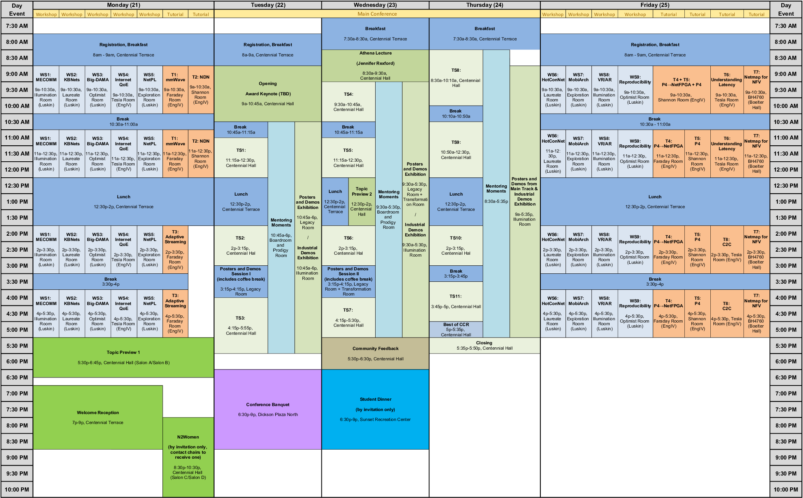

# {{page.title}}

<!-- 
Kindly note that the schedule below is tentative and subject to updates. You may also subscribe to the <a href="https://calendar.google.com/calendar/embed?title=ACM%20SIGCOMM%20Agenda&amp;showTitle=0&amp;showPrint=0&amp;showCalendars=0&amp;mode=AGENDA&amp;height=600&amp;wkst=1&amp;hl=en&amp;bgcolor=%23ffffff&amp;src=fgkdoih822v80dfk304pt56fjo%40group.calendar.google.com&amp;color=%23125A12&amp;ctz=America%2FSao_Paulo">SIGCOMM conference schedule</a> on Google calendar.
 -->

<h2></h2>

<!-- 

  <a href="images/sigcomm2017-schedule.pdf" target="_blank" rel="external">Conference Schedule at a Glance </a>

 

  <ul>
    <li><a href="#" onClick="filter('sunday');">Sunday</a></li>
    <li><a href="#" onClick="filter('monday');">Monday</a></li>
    <li><a href="#" onClick="filter('tuesday');">Tuesday</a></li>
    <li><a href="#" onClick="filter('wednesday');">Wednesday</a></li>
    <li><a href="#" onClick="filter('thursday');">Thursday</a></li>
    <li><a href="#" onClick="filter('friday');">Friday</a></li>
    <li><a href="#" onClick="filter('all');" class="ui-btn-active ui-state-persist roundright">All Days</a></li>
  </ul>

-->

