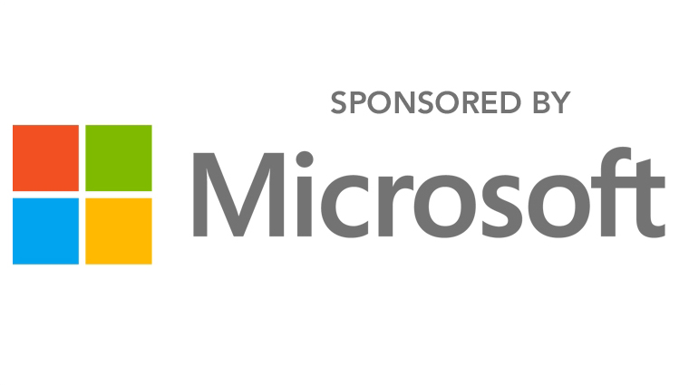

# ACM Student Research Competition (SRC)
TBA

<!--
## Introduction

The ACM Student Research Competition (SRC) offers a unique forum for undergraduate and graduate students to present their original research before a panel of judges and attendees at well-known ACM-sponsored and co-sponsored conferences.

Winners of the ACM SRC at SIGCOMM will advance to ACM Grand Finals of the Student Research Competition to compete against the winners of other ACM conferences.
The SRC, including a small travel budget for each participant, is sponsored by Microsoft Research.

## Who is eligible?

You have to submit a [poster or demo abstract](cf-posters.html).
Qualified entrants must have current ACM student membership, have graduate or undergraduate student status at the time of submission (May 2017), and be the only student working on the project.

If a graduate student is part of a group research project and wishes to participate in an SRC, they can submit and present their individual contribution to the group research project.
Following the same spirit, in case of demo submissions, the student contributions should be clearly defined.

## How to participate?

The SIGCOMM poster and demo sessions will also serve as an ACM Student Research Competition.
To enter the first stage of the SRC, submit a [poster or demo abstract](cf-posters.html).

While not mandatory, entrants are encouraged to submit a letter from their advisor describing the specific contributions made by the student.
Undergraduates and graduate students will be treated in separate divisions (students starting their first year of graduate school at the time of the conference will be considered as undergraduates).

A small travel supplement is made available to accepted SRC entrants; please also submit applications for travel grant support.

## Sponsors

## <i class="fa fa-calendar"></i> Important Dates



## Organizers


-->